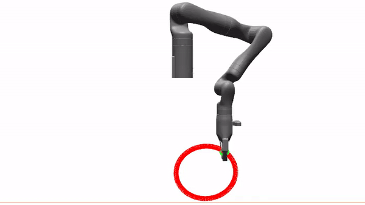
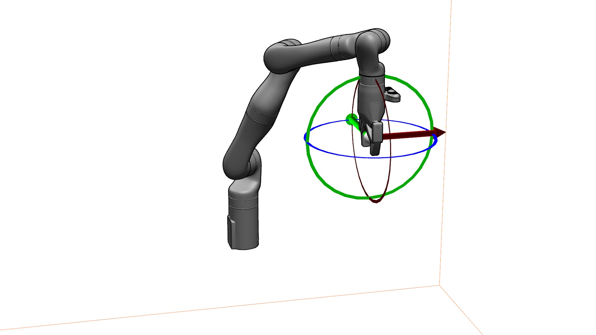

# Expansion-GRR: Efficient Generation of Smooth GRR Roadmaps
Implementation of our ICRA'23 paper: RangedIK: An Optimization-Based Robot Motion Generation Method for Ranged-Goal Tasks

A Python implementation of our IROS 2024 paper: *Expansion-GRR: Expansion-GRR: Efficient Generation of Smooth Global Redundancy Resolution Roadmaps*

[(TBA) [Paper]()] [[Pre-print](https://arxiv.org/abs/2405.13770)] [(TBA) [Presentation Video]()] [(TBA) [Poster]()]

This is a method for efficient generation of smooth global
redundancy resolution roadmaps. A teleoperation pipeline utilizing the built roadmaps is also demonstrated in this package.



## Dependency

Python3.8+ with extra packages

- Robot model and kinematics solution - **Klampt**
- Visualization packages with Klampt - **PyOpenGL**, **PyQt5**
- Progress visualization tools - **tqdm**
- Graph package - **networkx**
- Nearest neighbor packages - **scikit-learn**, **pynndescent**, **numba**
- Evaluation function - **fastdtw**

```
pip install -r requirements.txt
```

## Build GRR Roadmaps

To build a GRR roadmap for a robot

`python redundancy.py <robot_name> <rotation_type>`

Here, `<robot_name>` is the name of the robot folder under **problems** folder, and `<rotation_type>` is the name of a json file under the robot folder, defining different requirements of the task space. 

For example,

`python redundancy.py kinova rot_free`

This builds the roadmap for Kinova robot with the task constraints only posed on position component, having the rotation component to be free.

## Visualization and Interaction

To visualize the results and interact with the robot

`python demo.py <robot_name> <rotation_type>`

Same as the previous section. `<robot_name>` is the name of the robot folder under **graph** folder where the built roadmaps are stored. `<rotation_type>` is the name of a json file under the robot folder.

For example,

`python demo.py Kinova rot_free`

This runs the visualization application to test the roadmaps result. You will teleoperate Kinova with the task space only defined with position component.



When running the visualization application, you may:

Main Camera Control

- **Mouse left click and move** - This will rotate the main camera
- **Mouse left click + Press Control and move** - This will move the main camera
- **Mouse left click + Press Shift and move** - This will zoom in/out the main camera

Robot Control

- **Mouse right click and drag the widget** attached to the robot end effector - This will move the widget to a new point in the space, and the robot will try to follow it.

Keyboard Functions

- **Press "g"** - This will switch between the "workspace graph view" and "disconnected edges only view". By default, it will show the "disconnected edges only view".
- **Press "i"** - This will toggle between the "inspection mode" and "teleoperation mode". In inspection mode, the robot will only go to exact workspace node. This is mainly for debugging purpose. By default, it is the "teleoperation mode".
- **Press "w"** - If a configuration trajectory and a workspace path are set up, pressing "w" will visualize the workspace path and command the robot to follow the configuration trajectory. This is for result demonstration purpose.
